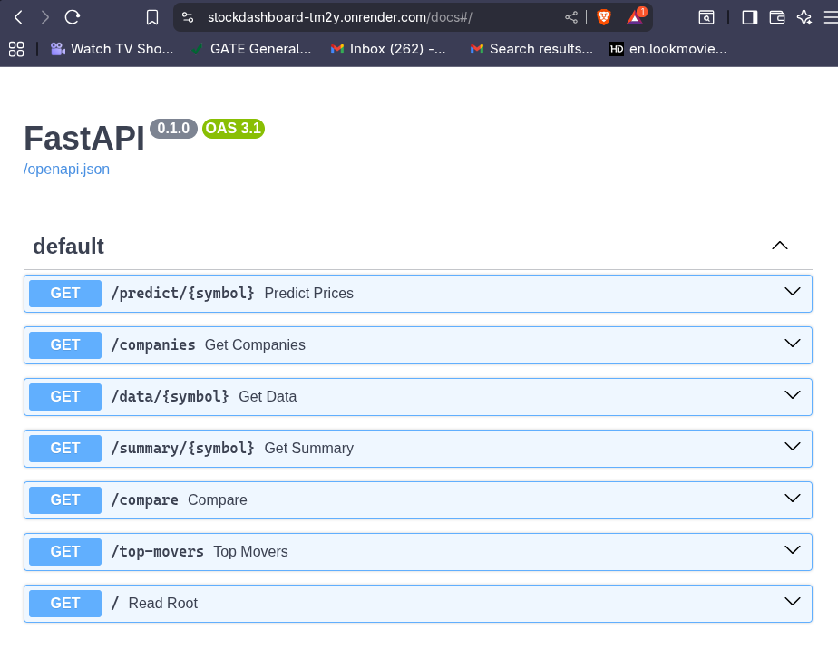

# Stock Data Intelligence Dashboard

A mini financial data platform built with FastAPI + SQLite + Chart.js.

## Tech Stack
| Tool | Purpose |
|------|---------|
| FastAPI | REST API backend |
| SQLite + SQLAlchemy | Database |
| Pandas + NumPy | Data processing |
| scikit-learn | Price prediction |
| Chart.js | Visualization |
| Docker | Containerization |

## Quick Start
```bash
git clone https://github.com/CodeEzard/StockDashboard
cd StockDashboard/backend
pip install -r requirements.txt
python mock_data.py
python migrate_mock_to_stockdata.py
uvicorn main:app --reload
```

## API Endpoints
| Method | Endpoint | Description |
|--------|----------|-------------|
| GET | /companies | List all stocks |
| GET | /data/{symbol}?days=30 | OHLCV + indicators |
| GET | /summary/{symbol} | 52W high/low, volatility |
| GET | /compare?symbol1=&symbol2= | Normalized comparison |
| GET | /top-movers | Top gainers & losers |
| GET | /predict/{symbol}?days=14 | ML price prediction |

## Custom Metrics
- **Volatility Score**: 30-day rolling std of daily returns × 100
- **Momentum Score**: % price change over last 30 days

## Data Source
Mock data generated using numpy random walk simulating realistic
NSE stock price movement. Pipeline ready for live yfinance data.

## Live Demo
- Frontend: [webURL](https://codeezard.github.io/StockDashboard/)
- API Docs: [backend](https://stockdashboard-tm2y.onrender.com/docs)
- Frontend: [https://codeezard.github.io/StockDashboard/](https://codeezard.github.io/StockDashboard/)


## API Documentation

All endpoints are documented via Swagger UI:
👉 [Live API Docs](https://stockdashboard-tm2y.onrender.com/docs)


